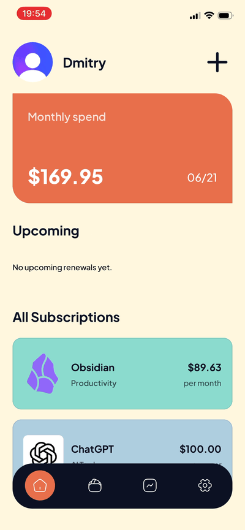
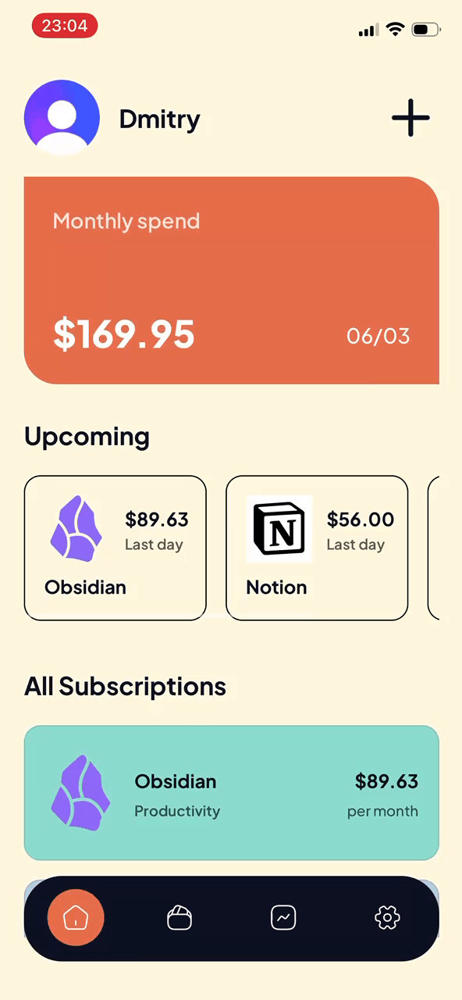
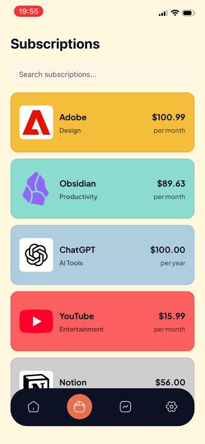
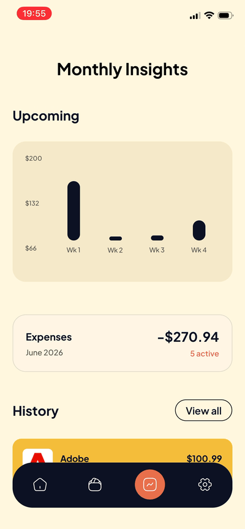
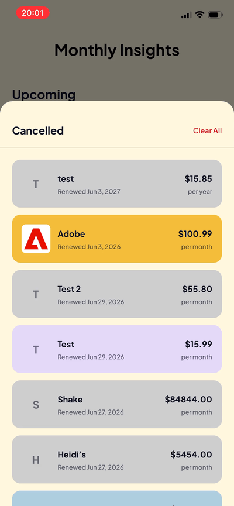

# Recurrly

> A production-quality subscription tracker built with React Native + Expo.

Track recurring expenses across services like Netflix, Spotify, and iCloud. See your monthly spend, upcoming renewals, and full subscription history — backed by a real database, real authentication, and UX that feels finished.

---

## Demo

| Home & Edit | Create subscription | Upcoming renewals |
|:-----------:|:-------------------:|:-----------------:|
|  |  |  |

| Search | Monthly Insights | History |
|:------:|:--------:|:-------:|
|  |  |  |

---

## Features

- **Home dashboard** — monthly spend total, next renewal date, and a 7-day upcoming renewals carousel
- **Subscription list** — searchable by name, category, or plan; tap to expand, edit inline, or cancel
- **Monthly insights** — interactive weekly spending chart (tap a bar to inspect that week's total), expense summary, and chronological subscription history
- **History sheet** — swipe-up bottom sheet showing all cancelled subscriptions; swipe-to-dismiss or clear all with a confirmation prompt
- **Authentication** — Clerk sign-in and sign-up with email OTP verification and persistent sessions
- **Per-user data** — every subscription is stored in Supabase and secured per-user at the database level via Row Level Security

---

## Technical highlights

### Backend + auth: Clerk + Supabase via JWT

Supabase stores the data with Row Level Security enforced at the PostgreSQL level. Clerk is the auth provider — its JWT token is passed as a `Bearer` header on every request, and Supabase RLS checks the JWT claims to ensure users can only read and write their own data. This is a non-standard integration (Supabase normally expects its own JWT), and getting it right required understanding how RLS policies work under the hood.

### Server state with TanStack Query

All server interactions live in two custom hooks — `useSubscriptions` and `useHistory`. The Home and Subscriptions tabs both call `useSubscriptions()` and share the same TanStack Query cache automatically — no duplicate network requests, no manual sync.

Edit and cancel mutations use the full optimistic update pattern:

1. **`onMutate`** — update the local cache immediately, save a rollback snapshot
2. **`onError`** — restore the snapshot silently if the server returns an error
3. **`onSettled`** — re-sync with the server regardless of outcome

The result: edits and cancellations feel instant. No loading spinners, no visible lag between action and UI response.

This project started with Zustand for state management. After recognizing that storing server data in Zustand was an anti-pattern — no caching, no invalidation, manual updates everywhere — I migrated to TanStack Query, which is built specifically for this.

### Animated bottom sheet (Reanimated 4)

The History sheet is a custom implementation, not a library component. It uses `useSharedValue` and `useAnimatedStyle` for the sheet position, `withSpring` to open, and `withTiming` to close. The starting position is `useWindowDimensions().height` — not a hardcoded pixel value — so it works correctly on every screen size.

Swipe-to-dismiss is handled with React Native's built-in `PanResponder`. The gesture only activates for downward vertical movement (`dy > 8 && dy > |dx|`), so the ScrollView inside the sheet scrolls independently without conflicting with the dismiss gesture. PanResponder callbacks are accessed through refs (`animateCloseRef.current`) to avoid stale closure bugs — `PanResponder.create` runs once, but the callbacks always call the latest version of the function.

### Auto-advancing renewal dates

On every app load, subscriptions with a `renewalDate` in the past are automatically bumped forward by one month or one year (depending on billing cycle). The comparison uses `startOf('day')` — not `Date.now()` — so a subscription renewing today isn't considered "past" mid-day and accidentally advanced.

### Soft delete for subscription history

Cancelling a subscription sets `status = 'cancelled'` instead of deleting the row. `fetchSubscriptions` filters `.neq('status', 'cancelled')` so cancelled items don't appear in the active list; `fetchHistory` filters the reverse. One table, two views, history is always preserved.

### UX details worth mentioning

- Subscription cards expand on header tap only. Tapping fields inside the expanded card body doesn't accidentally collapse it — the outer element is a `View`, only the header row is a `Pressable`.
- `keyboardDismissMode` switches between `'on-drag'` (search mode) and `'none'` (edit mode). During search, dragging the list dismisses the keyboard. During card editing, the keyboard stays visible while scrolling so the user can scroll the card above it.
- `contentContainerStyle.paddingBottom` grows from 120px to 400px when any card enters edit mode, giving room to scroll a card above the keyboard.
- The upcoming renewals carousel is powered by real data filtered to a 7-day window from `dayjs()` — not hardcoded.
- Renewal date is shown as a live preview while editing the start date field — no "recalculate" button needed.

---

## Stack

| | Why |
|---|---|
| **Expo SDK 54 + Expo Router v3** | File-based routing, the modern standard for new RN projects |
| **TypeScript** | Strict typing throughout; shared interfaces in `type.d.ts` |
| **Supabase (PostgreSQL)** | Real backend with Row Level Security enforced at DB level |
| **Clerk** | Auth provider; JWT-based Supabase RLS integration |
| **TanStack Query v5** | Server state caching, invalidation, optimistic mutations |
| **React Native Reanimated 4** | 60fps animations; `withSpring` / `withTiming` / `useSharedValue` |
| **NativeWind v5** | Tailwind utility classes in React Native; all styles in `global.css` |
| **dayjs** | Lightweight date manipulation — renewal calculations, period formatting |

---

## Background

This project started life as a two-screen UI built following a React Native course — no backend, no real data, just static mock subscriptions and routing fundamentals. I used it as a foundation and independently built everything that makes it a real product:

- Full Supabase backend with Row Level Security
- Clerk authentication with JWT-based Supabase integration (not the default Supabase Auth flow)
- TanStack Query data layer — started with Zustand, migrated when I understood why it was the wrong tool for server state
- Custom Reanimated 4 bottom sheet with swipe-to-dismiss
- Interactive Insights chart with real per-week spend data
- Inline edit flow with input masking, draft state, and live renewal date preview
- Optimistic updates on all mutations with silent rollback
- Splash screen, safe area handling, keyboard management, FlatList performance patterns

During development I used [CodeRabbit](https://coderabbit.ai) for automated PR review, which helped me identify patterns and improve code quality. I also evaluated PostHog for user analytics and explored the EAS Build pipeline for App Store deployment.
